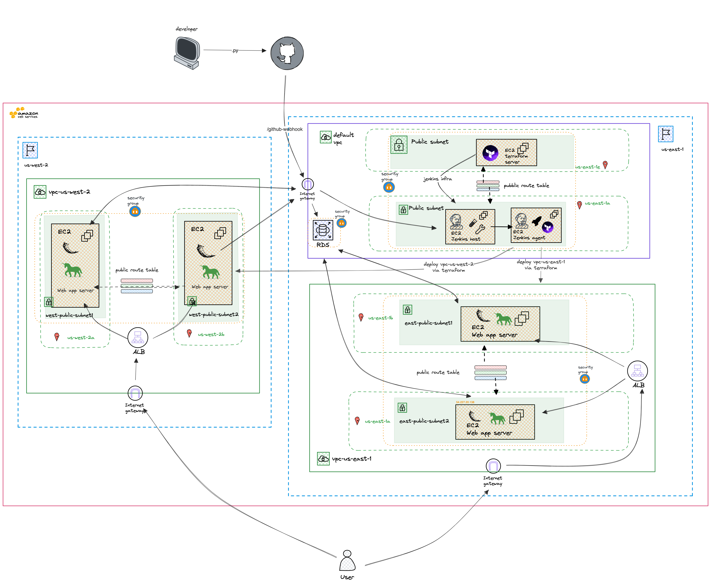
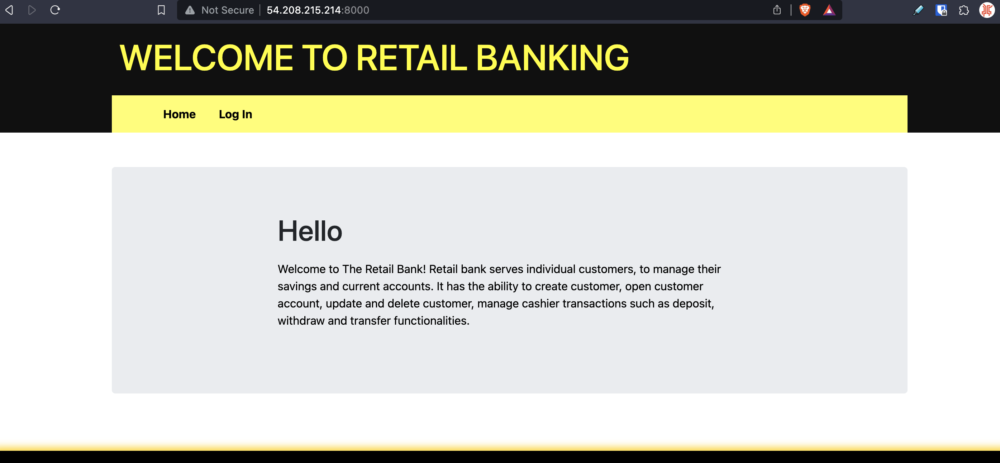

# Retail Banking Application Deployment with Terraform and Jenkins Hosted Across Two AWS Regions

**This is guide to use infrastructure as code and application code to deploy a Flask web application to two Amazon regions (us-east-1, and us-west-2). Each region has a virtual private cloud with two public subnets each with an EC2 instance hosting the web application. The repository also includes the infrastructure as code for the Jenkins host and agent server that is used for the continuous delivery and continuous deployment pipeline. The Jenkins infrastructure is hosted in a subnet set as a variable in the Terraform code**

**The web application in each EC2 share a MySQL database managed by Amazon's Relational Database Service (RDS).**

**Each VPC has an application load balancer that evenly distributes traffic to the EC2 instances hosting the web application.**

**Note: The the application code was cloned from [here](https://github.com/kura-labs-org/c4_deployment-6)

## Terraform

Terraform is central to this project and helps avoid the manual creation and configurations of resources in AWS. With resources like, a vpc, subnet, security group, etc. are define in a .tf file. The Terraform code is then executed to create the resources in the cloud.

A terraform project can be started with a simple init command

```bash
terraform init
```

Before we can create resources we need to provide authentication details to Terraform so that we can access our aws account. If the aws cli is installed and authenticated we can cat the credentials file to see the authentication details.

```bash
cat ~/.aws/credentials
```

It's possible to add the credential to a provider block on the .tf file but local environment variables can also be set. The environment variables are set in the terminal session that Terraform is runs in. In the case of the Terraform that creates the vpc, the AWS_ACCESS_KEY_ID and AWS_SECRET_ACCESS_KEY need to be stored as credentials in Jenkins. The credentials are used by the Jenkins pipeline and passed to the Terrafrom code.

```bash
export AWS_ACCESS_KEY_ID="anaccesskey"
export AWS_SECRET_ACCESS_KEY="asecretkey"
```

As the resources are defined in the .tf file ``validate`` can be used to check the syntax of the code

```bash
terraform validate
```

``plan`` can be used to see what resources will be created in the cloud

```bash
terraform plan
```

If the plan is as expected the resources can be created with ``apply``

```bash
terraform apply
```

``destroy`` can be used to destroy the resources created with ```apply``

```bash
terraform destroy
```

***variables.tf***
With Terraform a variables.tf file can be used to store variables that are used in the Terraform code. The variables can be set in the variables.tf file like:

```terraform
variable "key-name" {
  default = "mykey"
}
```

This is helpful so that the variables can be set in one place and used in multiple places in the Terraform code. The variables can be used in the Terraform code like:

```terraform
resource "aws_instance" "jenkins-host" {
  ami           = "ami-0dc2d3e4c0f9ebd18"
  instance_type = "t2.micro"
  key_name      = var.key-name
  ...
}
```

Be sure to include the variables.tf file in the [.gitignore](.gitignore) file so that the variables.tf file is not pushed to github.

## Jenkins Infrastructure

A Jenkins host and agent is deployed to an already existing subnet in an already existing VPC with the terraform code in [/jenkins-infra](/jenkins-infra/). The subnet id of the target subnet is a variable passed to the terraform code. The bash scripts [1](/jenkins-infra/jenkins-host-install.sh) ``jenkins-host-install.sh`` and [2](/jenkins-infra/jenkins-node-install.sh) ``jenkins-agent-install`` scripts passed to the user data of EC2 definitions in terraform code are used to install and configure Jenkins on the host and agent servers. The scripts include all dependencies to build, test and deploy the applications e.g. Python, Terraform. Refer to the [Terraform section](#terraform) for more information on how to use the Terraform code.

Once the Terraform has been applied he Jenkins user interface is accessible at the public ip of the EC2 and port 8080

## Jenkins Pipeline definition on Jenkins Host

A multibranch pipeline is used to build and deploy the web application. The pipeline is configured to build the application when a push is made to the main branch of the repository.

- Retrieve admin password from /var/jenkins/secrets/initialAdminPassword
- Navigate to {public.ip}:8080 on a browser to configure the dashboard. There will be a prompt to enter the admin password
- Install the recommended plugins

  - From your Jenkins dashboard navigate to Manage Jenkins > Manage Plugins and select the Available tab. Locate this plugin by searching for pipeline-keep-running-step.
- Navigate to 'New Item'
- Select multibranch pipeline
- Name the pipeline
- For "Branch Sources" choose GitHub
- Under the Github section
- Click on 'Add' under the credential drop down, select Jenkins
- Click on the Kind dropdown select 'Username with password'
- Add the Github username that has rights to the respository to the username' field
- In the 'password' field add the GitHub token you generated
- Click 'Add'. The modal will close.
- Select the credential that were created in the 'Credentials' dropdown
- In the 'Repository HTTPS URL' field add the repositories URL
- Remove all behaviors except 'Discover branches' and select 'all branches'

The ``jenkins-host-install.sh``  passed to terraform generates an ssh key pair that is used to authenticate the Jenkins host against the Jenkins agent

```bash
# login
sudo su - jenkins

# generate ssh keys for jenkins user. N flag is for empty password
ssh-keygen -t rsa -N "" -f ~/.ssh/id_rsa
```

To retrieve the public key, login to the jenkins host server and login to the jenkins user that owns the ssh keys and retrieve the public key

```bash
sudo su - jenkins
cat .ssh/id_rsa.pub
```

The public keys needs to be added to the authorized_keys file on the agent server. Open the authorized_keys file on the agent server and paste the public key in the file. The authorized_keys file is located at /home/ubuntu/.ssh/authorized_keys

Confirm the ssh connection into the agent server from the host server:

```bash
ssh ubuntu@{agent-server-private-ip}
```

***Jenkinsfile***

The Jenkinsfile includes init, plan and apply stages that use the Terraform code in [initTerraform](/initTerraform/) on the Jenkins agent server to deploy the web application multi region infrastructure.

```groovy
    stage('Init') {
      agent {
        label 'awsDeploy'
      }
    
      steps {
        withCredentials([
          string(credentialsId: 'AWS_ACCESS_KEY', variable: 'aws_access_key'), 
          string(credentialsId: 'AWS_SECRET_KEY', variable: 'aws_secret_key')
        ]) {
          dir('initTerraform') {
            sh 'terraform init' 
          }
        }
      }
    }
  
    stage('Plan') {
      agent {
        label 'awsDeploy'
      }
    
      steps {
        withCredentials([
          string(credentialsId: 'AWS_ACCESS_KEY', variable: 'aws_access_key'), 
          string(credentialsId: 'AWS_SECRET_KEY', variable: 'aws_secret_key')
        ]) {
          dir('initTerraform') {
            sh 'terraform plan -out plan.tfplan -var="aws_access_key=$aws_access_key" -var="aws_secret_key=$aws_secret_key"' 
          }
        }
      }
    }
  
    stage('Apply') {
      agent {
        label 'awsDeploy'
      }
    
      steps {
        withCredentials([
          string(credentialsId: 'AWS_ACCESS_KEY', variable: 'aws_access_key'), 
          string(credentialsId: 'AWS_SECRET_KEY', variable: 'aws_secret_key')
        ]) {
          dir('initTerraform') {
            sh 'terraform apply plan.tfplan' 
          }
        }
      }
    }
  }
```

## Github

 Automatic builds and deployments with Jenkins are facilitated by the Github webhook on the Jenkins host server. A POST to the webhook will kick off the pipeline.

- Navigate to Github users setting
- Click on 'Developer Settings'
- Click on the 'Personal Access Tokens' dropdown and select 'Tokens (classic)'
- Click on the 'Generate new token' dropdown and select 'Generate new token (classic)
- Add an appropriate note like 'Jenkins Controller'
- Full control of the respository is required. Also select admin:repo_hook
- SAVE THE TOKEN, the token will not be displayed again

Add a webhook so that when we push to main it triggers a jenkins build

- Navigate to the repositories settings in Github
- Click on 'Webhook' and 'Add Webhook'
- Add {jenkins-server-ip:port}/github-webhook/. This comes with the Jenkins Github plugin

## Jenkins Agent Setup

In the Jenkins dashboard, navigate to Manage Jenkins > Manage Nodes and Clouds > New Node

Name the node
Select 'Permanent Agent'
Click 'OK'
In the 'Remote root directory' field add the path to the Jenkins user home directory. '/home/ubuntu/agent1' works.
In the 'Labels' field add a label. 'awsDeploy'. This to identify the agent se
In the 'Launch method' dropdown select 'Launch agent via SSH'
In the 'Host' field add the public ip address of the agent server
In the 'Credentials' dropdown select 'Jenkins'
In the 'Username' field add the username of the agent server .e.g. 'ubuntu'
In the 'Private key' dropdown select 'Enter directly'
Copy the private key from the Jenkins server and paste it into the 'Private key' field
Click 'Save'
Click 'Launch agent'
Click 'Save'
Click 'Back to Dashboard' and you'll see your agent running

*AWS credential used by Jenkins agent*
An AWS Access Key and Secret Key are required by the Jenkins agent to deploy the web application infrastructure. The keys are stored as credentials in Jenkins. The credentials are used by the Jenkins pipeline and passed to the Terraform code

Follow these steps twice to add the AWS Access Key and Secret Key to Jenkins

- Navigate to Jenkins dashboard
- Click on 'Credentials' on the left hand side
- Click on 'System' on the left hand side
- Click on 'Global credentials (unrestricted)'
- Click on 'Add Credentials'
- Under 'Kind' select 'Secret text'
- Add the AWS Access Key to the 'Secret' field
- Add an appropriate description like 'AWS Access Key'
- Click 'OK'
- Click on 'Add Credentials'

## MySQL Database in AWS RDS

- Navigate to AWS RDS on the AWS console
- Click on 'Create database'
- Select 'MySQL'
- Select 'Free tier'
- Click 'Next'
- In the 'Settings' section:
  - In the 'DB instance identifier' field add a name for the database
  - In the 'Master username' field add a username for the database
  - In the 'Master password' field add a password for the database
  - In the 'Confirm password' field add the password again
  - Click 'Next'
- Select 'Yes" for 'Public access'
- Create a security group with ingress on port 3306. egress can be set to all traffic
- In the Additional configuration section:
  - In the 'Initial database name' field add a name for the database, e.g. 'banking'
- Unselect 'Enable encryption'
- Click 'Create database'
- Find the database in the section 'Databases' and click on the database name
- Retrieve the endpoint from the 'Connectivity & security' section

This endpoint will be used in the application code to connect to the database

## Application Code

In the application code for [app.py](app.py), [database.py](database.py) and [load_data.py](load_data.py) find the ``DATABASE_URL`` constant in each file and replace the connection string with the connection string of the database created in AWS RDS. The connection string is in the format:
[mysql+pymysql://]{username}:{password}@{host}/{database-name}

## Push to Github

Commit and push the changes to the repository. This will trigger the Jenkins pipeline. The pipeline will create the infrastructure in AWS and deploy the web application to the EC2 instances in the public subnets.

```bash
git add .
git commit -m "message"
git push
```

## VPCs Deployed with Terraform

The [Terrafrom code](/initTerraform/) to host the the wep app creates two VPCs, one in us-east-1 and another in us-west-2. Each VPC contains the following:

- Two availability zones (data centers).
- One internet gateway, the service that allows the vpc to connect to the public internet.
- Two public subnets. One in each availability zone.
- Two EC2 instances. One in each public subnet. The EC2 instances host the web application.
- Amazon creates a default route table for each vpc. We create a custom route table for our public subnets. The custom route table has a route that directs traffic to the internet gateway. The custom route table is associated with the public subnets.
- A security group is used for both public subnets. The security group allows inbound traffic on port 80, 8000 (http) and port 22 (ssh). The security group allows outbound traffic on all ports.

The ``install-banking-app.sh`` [script](/initTerraform/install-banking-app.sh) passed to the user data of the EC2 definitions in the Terraform code is used to install and configure the web application on the EC2 instances



Navigate to the public ip of and EC2 instance on port 8000 to see the web application



## Application Load Balancers

The EC2s in the public subnets are behind an application load balancer. The load balancer evenly distributes traffic to the EC2 instances.

To create the load balancer follow the directions in [load_balancer.md](load_balancer.md)

## Improvement

The Terraform code to create the VPCs is not very dynamic. As written, the code can only create two VPCs. The code can be improved by using a VPC module and using the module to deploy to different regions.

The creation of the application can be included a resource in the Terraform code.

The RDS database has no redundancy. At least snapshots should be taken of the database if not creating replicas.

The Jenkins agent can be in a private subnet with a NAT gateway to allow the agent to connect to the internet.